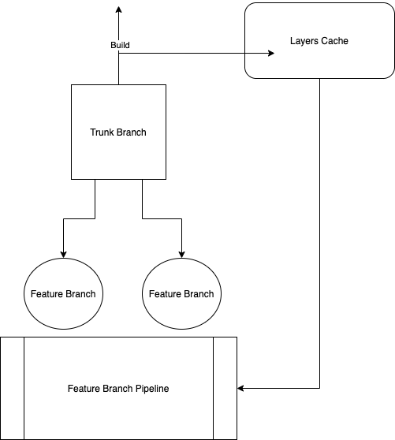

# Docker Layer Caching with Github Actions

The goal of this repo is to demonstrate how to go about using Github Actions with Docker Layer Caching

Essencially when we build from trunk, we cache those docker layers and we consume them in the feature branch pipelines.

Speeding up the builds.
